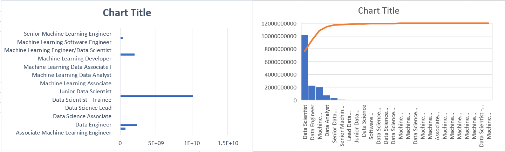

# Abhilash-ProfessionalsSalaryInIndia
## Dataset
Link: [Raw Dataset](https://www.kaggle.com/iamsouravbanerjee/analytics-industry-salaries-2022-india)

## About Data: 
This Dataset consists of salaries for Data Scientists, Machine Learning Engineers, Data Analysts, Data Engineers in various cities across India (2022).

## Findings: 
By using the mapper and reducer scripts I have processed the thousand's of dataset records into 26 records by reducing according to the title of profession which gathered in this year 2022. Among all the titles the data scentist has good scope of salaries as shown in the below charts.

## Chart: 
## Top 26 Professional salaries: 

